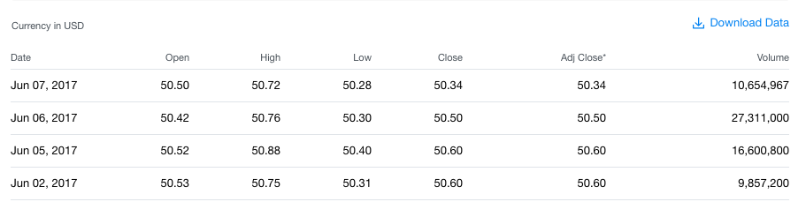
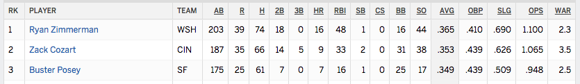
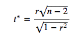
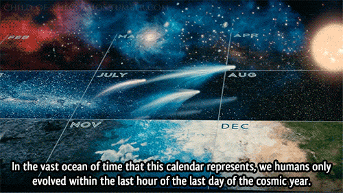

title: Data Visualization And Analysis
author:
  name: Jeremy Wicks
  twitter: JCole_W
output: basic.html
controls: true
theme: sudodoki/reveal-cleaver-theme

--

# D3: Data Driven Documents
## Using the D3 Library to Visualize and Analyze Data

--

### What is Data Analysis?

>“The goal is to turn data into information, and information into insight.” 

  -Carly Fiorina, Hewlett-Packard


--

### What Data Analysis isn't


---
### Gathering Data

* https://finance.yahoo.com/quote/YHOO/history/

* http://www.espn.com/mlb/statistics

---

##Elements of Data Analysis

---
###Correlation Coefficient

```javascript

	//execute correlation coefficient formula
	var r = ((n*sumXY) - (sumX*sumY))
	/Math.sqrt(((n*sumXX)-(sumX*sumX)) * ((n*sumYY)-(sumY*sumY)))
```
---
###Hypothesis Testing


---
### What D3 Is
* Javascript library for visualizing data
* Structure for applying data transformations
* Imperative 

---
### What D3 Isn't

* Backwards Compatible
* Private (Code executed on client)
* Automated

---

### Elements of a D3 Data Visualization

---

###Data
```
Team,shortName,starterIP,relieverIP,bullpenPercent,winPercent
San Diego Padres,SDP,306.2,196.2,0.3905254777,0.404
San Francisco Giants,SF,352.1,163,0.316443409,0.404
Miami Marlins,MIA,279.2,201.1,0.4186966479,0.426
Atlanta Braves,ATL,300.1,174.1,0.3671446647,0.434
Oakland Athletics,OAK,298.1,182.2,0.3793462419,0.436
New York Mets,NUM,293,202,0.4080808081,0.444
```
```javascript
const promiseCSV = Promise.promisify(d3.csv);

promiseCSV('stats.csv')

```
---
###SVG
```javascript
const h = 250
const w = 720

var svg = d3.select('body')

		.append('svg')
		.attr("width", w)
		.attr('height', h) 
		
```
Assigning to variable allows us to capture a reference to the svg we've created to hold our data

---

###Shapes

```javascript

	var circles = svg.selectAll('circle') 
	//create empty references. Set reference variable for later use
		.data(stats) 
		//bind data
		.enter() 
		//return placeholder reference to new element
		.append('circle') 
		//appends a circle to the DOM, at the end of the SVG element

```
---
###Scale

---

###Scale (cont.)
```javascript
	const xRange= [
	d3.min(stats, function(data){
		return data.x
	}),
	d3.max(stats, function(data){
		return data.x
	})
	]

	//set x and y scales to normalize data into chart space
	var xScale = d3.scaleLinear()
		.domain([xRange[0], xRange[1]]) 
		//range of possible input data values
		.range([0, w]) 
		//range of possible output data values

```
---

### Why D3?
>“Dynamic, interactive visualizations can empower people to explore the data for themselves”

-Scott Murray, *Interactive Data Visualization for the Web*

>"Overview first, zoom and filter, then details on demand" 

- Ben Shneiderman 

---

### Sources & Additional Resources
* https://github.com/curran/screencasts/tree/gh-pages/introToD3

* http://chimera.labs.oreilly.com/books/1230000000345/index.html

* https://www.varsitytutors.com/hotmath/hotmath_help/topics/line-of-best-fit

* https://onlinecourses.science.psu.edu/stat501/node/33

* http://www.datasciencecentral.com/

Code for this project available publicly at 
https://github.com/J-Wicks/d3TechTalk